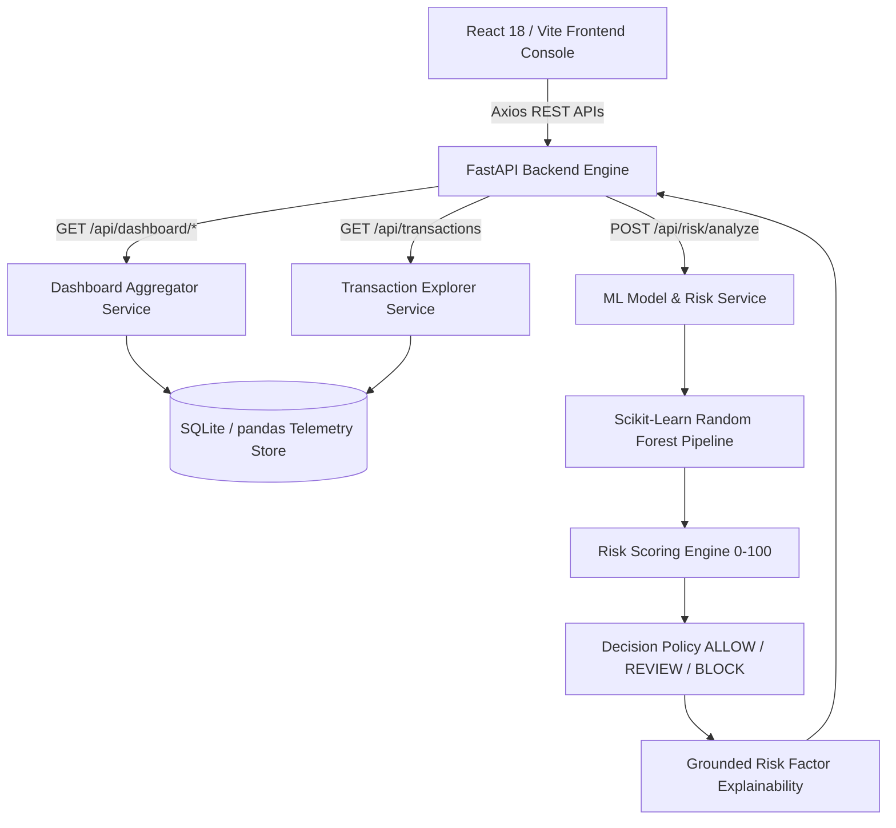

# PayGuard AI — Dashboard & Real-Time Risk Architecture

## Dashboard Data Flow & Components

1. **Frontend Layer (`frontend/src/`)**:
   - `Navbar.jsx`: Global dark fintech navigation bar with active route indicators and status badge.
   - `Dashboard.jsx`: Executive security console featuring KPI cards, Recharts fraud trend area chart, risk level donut chart, top threat vector catalog, and recent transaction monitoring table.
   - `Transactions.jsx`: Server-side searchable and paginated transaction telemetry explorer.
   - `Analyze.jsx`: Manual Risk Analyzer console with demo preset buttons ("Normal Clean", "Suspicious Spikes", "Critical ATO Vector").
   - `Analytics.jsx`: Technical breakdown of threat vector codes and risk level thresholds.

2. **Backend API Layer (`backend/app/routes/`)**:
   - `dashboard.py`: Exposes `/api/dashboard/stats`, `/api/dashboard/risk-distribution`, `/api/dashboard/fraud-trends`, `/api/dashboard/risk-signals`, `/api/dashboard/recent-transactions`.
   - `transactions.py`: Exposes `/api/transactions` with server-side `search`, `fraud_label`, `merchant_category`, `payment_method` filtering and pagination.
   - `risk.py`: Exposes `/api/risk/analyze` and `/api/transactions/{id}/risk`.

3. **Machine Learning & Risk Engine (`ml-engine/src/`)**:
   - `model_service.py`: Caches Random Forest artifacts and executes unified risk analysis.
   - `risk_scoring.py`: Maps fraud probability into calibrated 0–100 risk score and policy decision (`ALLOW`, `REVIEW`, `BLOCK`).
   - `explain.py`: Detects 11 grounded risk factor codes and synthesizes human-interpretable explanations.
