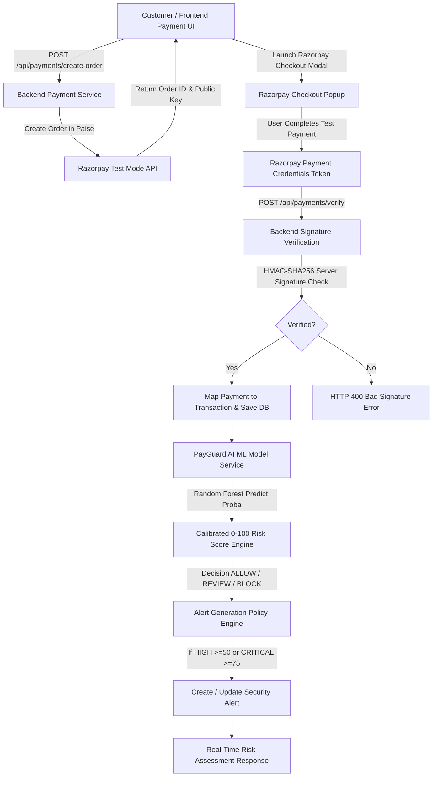

# PayGuard AI — Razorpay Test Mode Payment Architecture

## Security & Architecture Principles

1. **Test Mode Enforcement**:
   - Uses exclusively Razorpay Test Mode keys (`RAZORPAY_KEY_ID`, `RAZORPAY_KEY_SECRET`, `VITE_RAZORPAY_KEY_ID`).
   - `RAZORPAY_KEY_SECRET` is strictly contained within backend environment variables and is never exposed to frontend client builds.

2. **Server-Side HMAC-SHA256 Verification**:
   - Signature verification is strictly performed on the FastAPI backend prior to transaction logging or risk evaluation using `hmac.new(secret, order_id|payment_id, sha256)`.

3. **Zero Sensitive Cardholder Storage**:
   - PayGuard AI never accepts, processes, or stores card numbers, CVVs, expiry dates, or UPI PINs.

4. **Independent Risk Evaluation & Prototype Disclaimer**:
   - PayGuard AI operates as an independent risk analysis layer. In this demonstration prototype, test payments complete first, and PayGuard AI evaluates post-authorization risk for review/blocking recommendation.
