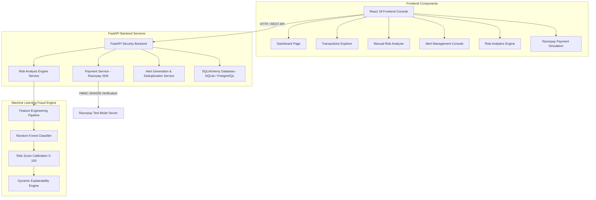

# PayGuard AI — Complete System Architecture

## System Workflow Summary

1. **Transaction Telemetry Intake**:
   - Accepts transaction inputs from synthetic datasets or live Razorpay test payments.
2. **Feature Engineering**:
   - Computes derived risk factors (velocity, distance, new device/IP flags, age ratios).
3. **Random Forest Inference**:
   - Generates fraud probability predictions ($P(\text{Fraud})$).
4. **Risk Score Calibration**:
   - Converts raw probability into 0–100 risk score and maps to `LOW`, `MEDIUM`, `HIGH`, or `CRITICAL`.
5. **Decision Policy**:
   - Enforces automated decision policy (`ALLOW` for LOW, `REVIEW` for MEDIUM/HIGH, `BLOCK` for CRITICAL).
6. **Explainability**:
   - Flags applicable threat vector codes and synthesizes natural-language explanations.
7. **Alert Engine**:
   - Automatically logs deduplicated security alerts for HIGH and CRITICAL risk levels.
